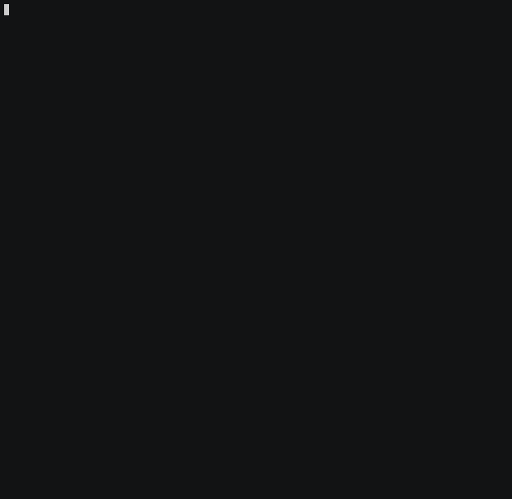

# future.tests: Test Suite for Future API Backends

The **[future]** package defines the Future API which consists of a small number of functions for writing [R] code that can be evaluated either sequential or in parallel based a single setting without having to change anything in the code.  Parallelization can be done via one of many backends, e.g. via built-in multicore, multisession and cluster backends (based on the **parallel** package) or via third-party backends such as **[future.callr]** and **[future.batchtools]**.  The design motto of the Future API is:

> Write once, run anywhere

In order for such code to work regardless of which future backend the end-user choose, it is critical that the backend fully complies with the Future API.  A future backend with A 100% compliance rate guarantees that the code will work equally well there as in sequential mode.

This R package - **[future.tests]** - provides a test suite for validation that a future backend complies with the Future API.




## Validate a Future Backend

All future backends implementing the Future API should validate that they conform to the Future API.  This can be done using the **[future.tests]** package, which provides two API for running the tests.  The tests can be performed either from within R or from outside of R from the command line making it easy to include them package tests and in Continuous Integration (CI) pipelines.

## From Within R

```r
> results <- future.tests::check(plan = "multisession")
> exit_code <- attr(results, "exit_code")
> if (exit_code != 0) stop("One or more tests failed")
```

## From Outside R

```sh
$ Rscript -e "future.tests::check" --args --test-plan="multisession"
$ exit_code=$?
$ [[ exit_code -eq 0 ]] || { >&2 echo "One or more tests failed"; exit 1; }
```

### Continuous Integration

#### Travis CI

To validate a future backend using future.tests on Travis CI, use a job matrix and add a separate job that runs `Rscript future.tests::check ...`.  Here is an excerpt of a `.travis.yml` with a job matrix where one of the job performs a regular `R CMD check --as-cran` and one validates a specific backend using **future.tests**.

```yaml
language: r
sudo: false
cache: packages
warnings_are_errors: false
r_check_args: --as-cran

matrix:
  include:
    - os: linux
      r: release
    - os: linux
      r: release
      r_github_packages:
        - HenrikBengtsson/future.tests
      script:
        - R CMD build --no-build-vignettes --no-manual .
        - R CMD INSTALL *.tar.gz
        - Rscript -e future.tests::check --args --test-plan="${BACKEND}"
      env: BACKEND='future.callr::callr'
```
See [.travis.yml of the future.callr package](https://github.com/HenrikBengtsson/future.callr/blob/develop/.travis.yml) for a full example.


## Installation
R package future.tests is only available via [GitHub](https://github.com/HenrikBengtsson/future.tests) and can be installed in R as:
```r
remotes::install_github("HenrikBengtsson/future.tests")
```


## Contributions

This Git repository uses the [Git Flow](http://nvie.com/posts/a-successful-git-branching-model/) branching model (the [`git flow`](https://github.com/petervanderdoes/gitflow-avh) extension is useful for this).  The [`develop`](https://github.com/HenrikBengtsson/future.tests/tree/develop) branch contains the latest contributions and other code that will appear in the next release, and the [`master`](https://github.com/HenrikBengtsson/future.tests) branch contains the code of the latest release.

Contributing to this package is easy.  Just send a [pull request](https://help.github.com/articles/using-pull-requests/).  When you send your PR, make sure `develop` is the destination branch on the [future.tests repository](https://github.com/HenrikBengtsson/future.tests).  Your PR should pass `R CMD check --as-cran`, which will also be checked by <a href="https://travis-ci.org/HenrikBengtsson/future.tests">Travis CI</a> and <a href="https://ci.appveyor.com/project/HenrikBengtsson/future-tests">AppVeyor CI</a> when the PR is submitted.


## Software status

| Resource:     | GitHub              | Travis CI       | AppVeyor         |
| ------------- | ------------------- | --------------- | ---------------- |
| _Platforms:_  | _Multiple_          | _Linux & macOS_ | _Windows_        |
| R CMD check   |  | <a href="https://travis-ci.org/HenrikBengtsson/future.tests"></a>   | <a href="https://ci.appveyor.com/project/HenrikBengtsson/future-tests"></a> |
| Test coverage |                     |                 |                  |


[R]: https://www.r-project.org
[future]: https://cran.r-project.org/package=future
[future.callr]: https://cran.r-project.org/package=future.callr
[future.batchtools]: https://cran.r-project.org/package=future.batchtools
[future.tests]: https://github.com/HenrikBengtsson/future.tests
